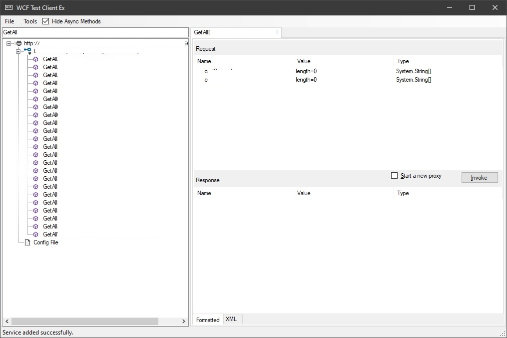

# WCF Test Client Ex 
*A WCF Test Client with extra features*  

Due to the limitations of the WCF Test Client in sorting and searching service methods, an advanced version of this software has been developed and is now available. The enhancements added to the original version include:

- Alphabetical sorting of methods  
- Option to hide async methods  
- Filtering and searching through methods  
- Middle click to close tabs

# Replace with official app

To replace the original software and run it directly in Visual Studio, rename the file `WcfTestClientEx.exe` to `WcfTestClient.exe` and copy all build files to the following directory:
    `C:\Program Files (x86)\Microsoft Visual Studio<Visual Studio Version like 2019>\Enterprise\Common7\IDE`

The source code is available for review and modification , If you make any changes and would like to share them, please submit a Pull Request.

If you believe this software would be helpful to someone , please feel free to introduce it to them.

Special thanks to [Mr. Soltani](https://github.com/majidsoltani), without whose help this project would not have been possible.
